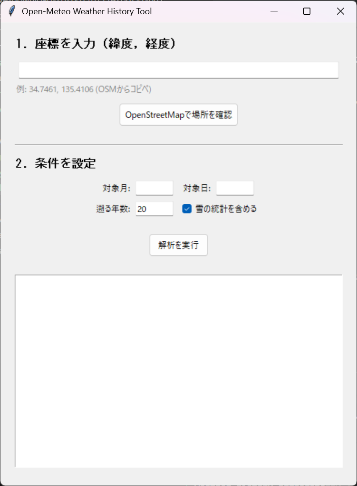

# Weather History Aggregate
Open-Meteo APIを使用して、特定の地点の過去数十年分の気象統計を一瞬で取得するツールです。  
オリエンテーリング大会の要項作成を支援することを目的としています。

## インストール方法

### uv を使用する場合 (推奨)
```bash
uv tool install git+https://github.com/he1se1/weatherHistoryAggregate.git
```

### pipx を使用する場合
```bash
pipx install git+https://github.com/he1se1/weatherHistoryAggregate.git
```

## 使い方
インストール後、`wx-agg` コマンドが使えるようになります。

### GUIを起動
引数なしで実行するとGUIが立ち上がります。
```bash
wx-agg
```


位置は座標で指定します。座標欄が空欄の時に[OpenStreetMapで場所を確認]ボタンを押すと、ブラウザでOpenStreetMapが開きます。取得したい箇所で右クリックして[アドレスを表示]で座標を表示でき、これを座標欄に貼り付けてください。

日付、年数、雪の統計を含めるかどうかを入力して実行すると統計が得られます。

### コマンドラインで実行
```bash
# 2月28日の大阪(34.6, 135.5)を20年分
wx-agg -d 2/28 -l 34.6,135.5 -s
```

## 開発
ローカルで開発モードとしてインストールする場合:
```bash
pip install -e .
```
